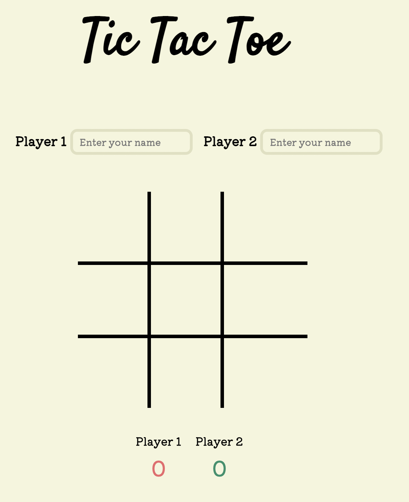

# Project 0 - Tic Tac Toe

Additional description about the project and its features.

## Built With

- HTML
- CSS
- JAVASCRIPT
- JQUERY

## Live Demo

Click this link to view site and play: [Live Demo Link](https://kimberleyfaith.github.io/project0/)

## Instructions to Play

- Introduce the name of the players.

- The game is played on a grid that is 3 squares by 3 squares.

- Player One will select a token. Players will then take turns putting their marks in empty squares.

- The first player to get 3 of their marks in a row (up, down, across, or diagonally) is the winner.

- When all 9 squares are full, the game is over. If no player has 3 marks in a row, the game ends in a tie.

# Features

- Ability to personalise the game with player names
- Interactive page with features displayed only when needed.
- When the user wins, show a unique transition
- Score board to log results

# Future Developments

- Understanding JavaScript data structures

- Figuring out what sort of JavaScript functions I want to have in my tic tac toe game.

- Deducing best practices with JavaScript to make sure that the end user is able to enjoy the game
